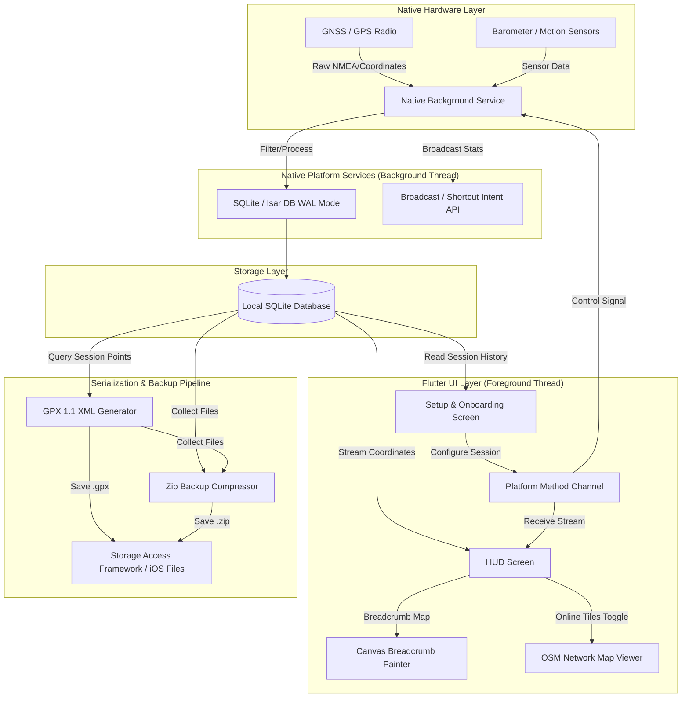
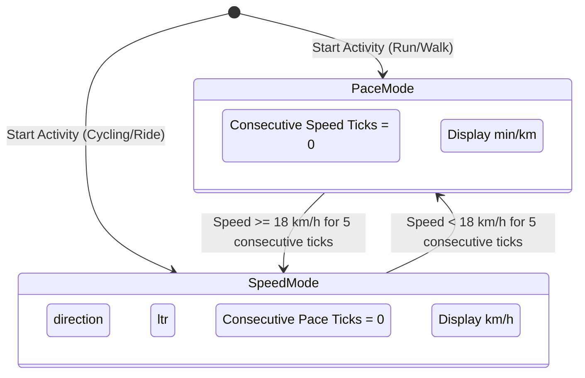

# TurnBack: Architecture Blueprint & Technical Specification

This document details the software architecture, database schema, mathematical models, native automation interfaces, and optimizations for **TurnBack** (formerly Activity Mapper)—an ultra-lightweight, 100% offline-first, battery-efficient out-and-back endurance tracking application.

---

## 1. Architectural Design & System Topology

The system is designed with a **decoupled, offline-first pipeline** that separates intensive background telemetry collection from the interactive user interface. This separation ensures the application runs reliably without the operating system terminating background processes due to CPU/memory limits.



### Decoupling Logic: Background Isolate Separation
1. **Native Telemetry Core**: Low-level GPS polling runs inside a platform-specific foreground channel (Android Foreground Service with `START_STICKY` / iOS `CLBackgroundActivitySession`). It does not run on the Flutter Dart VM thread.
2. **Persistence**: Coordinates are written directly to the SQLite/Isar local database from the native background service. This guarantees data preservation even if the Flutter UI is killed due to memory limits.
3. **Flutter UI Interaction**: The UI thread remains idle unless the screen is active. It interacts with the tracking state through `PlatformService` (Method Channels and Event Channels) and queries the local database on-demand.

---

## 2. Local-First Database Schema

To prevent data loss in the event of an operating system process termination, TurnBack uses a local-first SQLite database configuration with **Write-Ahead Logging (WAL)** enabled. This allows concurrent read operations (UI rendering) and write operations (Native background service appending coordinate points) without blocking.

```
                  +-----------------------------------+
                  |             sessions              |
                  +-----------------------------------+
                  | id: INTEGER PRIMARY KEY (AUTOINC) |
                  | activity_type: TEXT               |
                  | target_duration: INTEGER (seconds)|
                  | safety_buffer: REAL (percentage)  |
                  | start_time: INTEGER (epoch ms)    |
                  | end_time: INTEGER (epoch ms, NULL)|
                  | turn_back_triggered_at: INT (NULL)|
                  | status: TEXT ('active', 'paused') |
                  +-----------------------------------+
                                    |
                                    | 1
                                    |
                                    | N
                                    v
                  +-----------------------------------+
                  |              points               |
                  +-----------------------------------+
                  | id: INTEGER PRIMARY KEY (AUTOINC) |
                  | session_id: INTEGER (FOREIGN KEY) |
                  | timestamp: INTEGER (epoch ms)     |
                  | lat: REAL                         |
                  | lng: REAL                         |
                  | altitude: REAL                    |
                  | accuracy: REAL                    |
                  | speed: REAL (meters/second)       |
                  +-----------------------------------+
```

### Table Specifications
* **`sessions`**: Tracks active, paused, and completed workouts.
* **`points`**: Keeps track of coordinates logged during sessions, bound to a specific session via `session_id` using a foreign key constraint with cascade-on-delete.

---

## 3. Core Algorithms & Mathematical Heuristics

### A. The 54% "Fatigue-Aware" Turn-Back Engine
To address the fatigue asymmetry of out-and-back trips, the system avoids a simple 50% split. Instead, it implements a customizable **54% remaining countdown window** for timed activities. This reserves a **4% safety buffer** ($54\% - 46\% = 8\%$ extra time/energy allocation for the return leg) to account for cumulative physical fatigue, headwinds, or uphill climbs on the return leg.

Let:
* $T_{\text{target}}$ = Total allocated target duration (seconds)
* $T_{\text{elapsed}}$ = Active moving time of the workout (seconds)
* $B_{\text{buffer}}$ = Safety buffer percentage (default is $8.0\%$, configurable from $0\%$ to $20\%$)

The ratio of the workout allocated to the outbound leg ($R_{\text{outbound}}$) is calculated as:
$$R_{\text{outbound}} = \frac{100.0 - B_{\text{buffer}}}{200.0}$$

Using the default $8\%$ buffer:
$$R_{\text{outbound}} = \frac{100.0 - 8.0}{200.0} = 0.46 \quad (46\%)$$

The maximum duration allowed for the outbound leg ($Limit_{\text{outbound}}$) is:
$$Limit_{\text{outbound}} = T_{\text{target}} \times R_{\text{outbound}}$$

The turnaround alert triggers when the active moving time satisfies:
$$T_{\text{elapsed}} \ge Limit_{\text{outbound}}$$

When this condition is met:
1. A database write marks the timestamp in `sessions.turn_back_triggered_at`.
2. A high-priority native notification is pushed to the device.
3. The UI renders a flashing monochrome warning banner.

---

### B. Dynamic Velocity Unit Switching & Hysteresis
To keep the dashboard display clean and glanceable, the UI automatically toggles between runner-centric **Pace** (minutes per kilometer) and cyclist/transit-centric **Speed** (kilometers per hour).

* **Threshold**: $18.0 \text{ km/h}$ ($5.0 \text{ m/s}$).
* **Pace Calculation**:
  $$\text{Pace (min/km)} = \frac{16.6667}{\text{speed in m/s}}$$
* **Speed Calculation**:
  $$\text{Speed (km/h)} = \text{speed in m/s} \times 3.6$$

#### The Hysteresis State Machine
To prevent display flickering when traveling near the $18.0 \text{ km/h}$ boundary, the system uses a **5-second hysteresis window**.



---

## 4. Geodesic Calculations & Navigation Bearings

### A. Planimetric Distance (Haversine Formula)
The distance ($d$) between consecutive coordinates $P_1(\phi_1, \lambda_1)$ and $P_2(\phi_2, \lambda_2)$ (in radians) is calculated as:

$$\Delta \phi = \phi_2 - \phi_1$$
$$\Delta \lambda = \lambda_2 - \lambda_1$$
$$a = \sin^2\left(\frac{\Delta \phi}{2}\right) + \cos(\phi_1) \cdot \cos(\phi_2) \cdot \sin^2\left(\frac{\Delta \lambda}{2}\right)$$
$$c = 2 \cdot \arcsin\left(\sqrt{a}\right)$$
$$d = R \cdot c$$

where $R = 6371.009 \text{ km}$ (the Earth's volumetric mean radius).

### B. 3D Geodesic Distance
When altitude data is available, the distance calculation is adjusted to account for elevation changes:
$$\Delta d_{\text{elevation}} = |h_2 - h_1|$$
$$d_{\text{3D}} = \sqrt{d^2 + \Delta d_{\text{elevation}}^2}$$

### C. Bearing and Navigation Math
To generate navigation cues and guide the user along a past route, the system calculates the bearing angle ($\theta$ in degrees) between two coordinate points:

$$\theta = \text{atan2}\left(\sin(\Delta \lambda) \cdot \cos(\phi_2), \cos(\phi_1) \cdot \sin(\phi_2) - \sin(\phi_1) \cdot \cos(\phi_2) \cdot \cos(\Delta \lambda)\right)$$
$$\text{Bearing (Degrees)} = (\theta \times \frac{180}{\pi} + 360) \pmod{360}$$

The navigation engine flags turns based on the difference between consecutive bearings ($\Delta \text{Bearing} = \theta_2 - \theta_1$):
* **$\ge 35^\circ$ and $< 70^\circ$**: Right Turn / Left Turn
* **$\ge 70^\circ$**: Sharp Right Turn / Sharp Left Turn
* **Off-Route Detection**: Triggered if the user's perpendicular distance to the closest segment of the reference track exceeds $50.0 \text{ meters}$.

---

### D. Stationary Battery Saver (Stop Detection)
To minimize battery drain during stops (e.g., trail crossings or cafe breaks), the background service monitors user velocity. If the device remains stationary for a prolonged period, the service optimizes hardware polling:

* **Trigger**: Speed $< 0.2 \text{ m/s}$ or coordinates change by less than $1.5 \text{ meters}$ for 3 consecutive updates.
* **Optimization**: The service increases the GPS polling interval from high-frequency ($5\text{ s}$) to power-saving mode ($30\text{ s}$).
* **Resume**: Instantly restores standard $5\text{ s}$ polling when motion exceeds these thresholds.

---

## 5. Automation APIs & Intent Integration

TurnBack exposes native automation hooks, allowing users to control tracking and retrieve telemetry silently in the background using tools like **Android Tasker** or **iOS Apple Shortcuts**.

### A. Android Broadcast Receiver Intents
Exposed via the manifest under the action domain `org.opensource.tracker`:

| Action Intent | Parameters / Extras | Intent Target / Behavior |
| :--- | :--- | :--- |
| `org.opensource.tracker.START_ACTIVITY` | `mode` ("timed" \| "infinity")<br>`duration_mins` (Int)<br>`buffer_pct` (Double) | Spawns the foreground tracking service immediately, bypassing the main setup screen. |
| `org.opensource.tracker.STOP_ACTIVITY` | None | Terminates active background tracking, updates status to completed, and triggers the GPX auto-export pipeline. |
| `org.opensource.tracker.GET_CURRENT_STATS` | None | Returns a JSON string payload containing: `distance_km`, `elapsed_seconds`, `avg_speed_kmh`, `turn_back_triggered`. |

### B. iOS App Intents & Apple Shortcuts
Conforms to the Swift `AppIntent` and `LongRunningIntent` protocols:
* **`AutoExportSessionIntent`**: Runs via `LongRunningIntent` to allow extended background execution time. This allows the system to generate GPX files and write ZIP archives to disk without being terminated by the OS background watchdog.

---

## 6. Data Serialization, Storage & Backup

### A. GPX 1.1 Serialization
At the end of a session, a database reader processes coordinate tables and writes them directly to a standard, schema-compliant GPX 1.1 XML structure:

```xml
<?xml version="1.0" encoding="UTF-8"?>
<gpx version="1.1" creator="TurnBack" 
     xmlns="http://www.topografix.com/GPX/1/1" 
     xmlns:xsi="http://www.w3.org/2001/XMLSchema-instance" 
     xsi:schemaLocation="http://www.topografix.com/GPX/1/1 http://www.topografix.com/GPX/1/1/gpx.xsd">
  <metadata>
    <time>2026-07-11T11:00:00Z</time>
  </metadata>
  <trk>
    <name>RUN - Out and Back</name>
    <trkseg>
      <trkpt lat="12.9716" lon="77.5946">
        <ele>920.1</ele>
        <time>2026-07-11T11:02:30Z</time>
        <extensions><speed>2.8</speed></extensions>
      </trkpt>
    </trkseg>
  </trk>
</gpx>
```

### B. Storage Operations (Android SAF / iOS Documents)
* **Android**: Uses the Storage Access Framework (SAF) via `ACTION_CREATE_DOCUMENT` to prompt for a target directory. The application requests persistent URI read/write access via `takePersistableUriPermission()`, allowing automated, background GPX dumps without requiring broad read/write permissions.
* **iOS**: Writes exports directly to the app's sandboxed `Documents` directory, which is accessible via the native Files app.

### C. Compressed Backup Container (.zip)
The backup utility bundles:
1. The raw `turnback.db` SQLite file.
2. Database write-ahead logs (`turnback.db-wal` and `turnback.db-shm`) to preserve uncommitted transactions.
3. Previously exported `.gpx` tracks, organized inside a `/gpx_logs/` subdirectory.

These assets are compressed into a single ZIP archive, formatted as:
`turnback_backup_[TIMESTAMP].zip`

---

## 7. Sunlight-Optimized User Interface

To minimize battery drain and ensure readability under direct sunlight, the UI implements a **sunlight-optimized layout**:

1. **Ultra-High-Contrast Monochrome Theme**: Uses a high-contrast theme (pure white background with heavy black typography and indicators) to reduce screen glare under direct sunlight. This is more readable than standard dark interfaces and allows users to keep screen brightness lower, reducing battery consumption and thermal throttling.
2. **Minimalist GPU Load**: Avoids continuous rendering of heavy vector maps. Instead, it defaults to a lightweight, custom-painted canvas coordinate tracker (`BreadcrumbPainter`).
3. **On-Demand Raster Tiles**: Online OpenStreetMap tiles are only rendered when the user explicitly toggles map tiles (`OsmMapView`), saving CPU/GPU cycles and minimizing cellular data usage.
